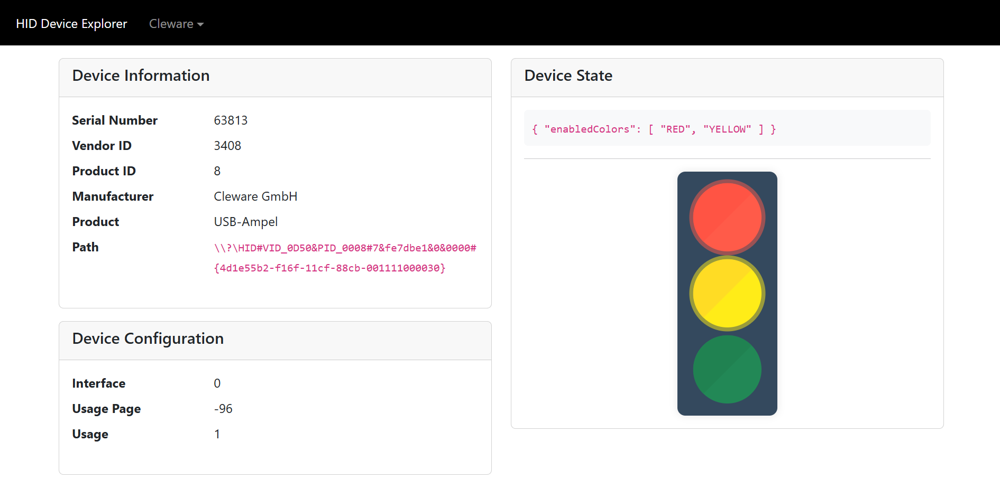

# HID Experiments
This repository contains the code for the experiments with HID devices (and thus serves no practical use beyond my own entertainment).

The majority of the code is written to be re-usable for various HID devices, though the primary implementation focuses on the [Cleware USB Traffic Light](https://www.cleware-shop.de/USB-MiniTrafficLight-EN).

The server code is written in Java (21) and uses [hid4java](https://github.com/gary-rowe/hid4java/) on the backend to communicate with the HID devices. The UI is written using Angular.

This project is inspired by an old project of mine, [GuusLieben/ClewareSocket](https://github.com/GuusLieben/ClewareSocket).